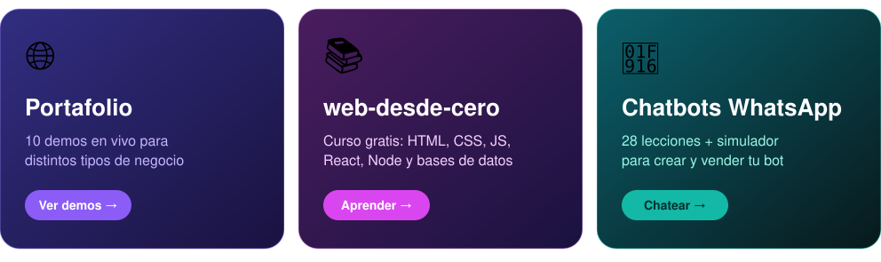

 

 

 

## 🚀 Qué hago

Todo pensado <b>primero para el celular</b>. <a href="https://cacg-code.github.io/#precios">Ver precios</a> · <a href="https://wa.me/51991053535?text=Hola%20Carlo%2C%20quiero%20una%20cotizaci%C3%B3n.">pedir cotización</a>

## 📦 Proyectos

<a href="https://cacg-code.github.io"><picture><source media="(max-width: 600px)" srcset="assets/readme/m-proyectos-m.svg"></picture></a>

<a href="https://cacg-code.github.io">Portafolio</a> · <a href="https://github.com/Cacg-code/web-desde-cero">web-desde-cero</a> · <a href="https://github.com/Cacg-code/chatbots-whatsapp-desde-cero">Chatbots de WhatsApp</a>

Toca una tarjeta para abrir el repositorio o el sitio.

## 🎓 Enseño gratis

<a href="https://cacg-code.github.io/web-desde-cero/"><picture><source media="(max-width: 600px)" srcset="assets/readme/m-ensenanza-m.svg"></picture></a>

<a href="https://cacg-code.github.io/web-desde-cero/">Web desde cero</a> · <a href="https://cacg-code.github.io/chatbots-whatsapp-desde-cero/">Chatbots de WhatsApp</a>

Toca una tarjeta para empezar el curso · hechos por un estudiante, con apoyo de IA, como aporte a la comunidad.

📍 Lima, Perú · Desarrollo con apoyo de IA, bajo mi dirección y revisión

